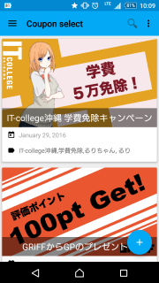
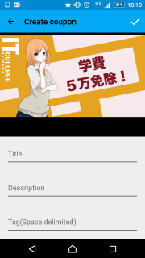
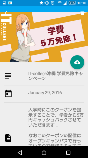
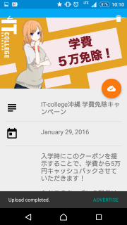

#ReachaBLE

##インストール方法
`Constants.java`の定数の値を書き換える

* `IDENTITY_POOL_ID:` AmazonS3へのアクセス権限があるAmazonCognitoのIdentity pool ID
* `BUCKET_NAME:` AmazonS3に作成したバケット名

書き換えた後にAndroidStudioでプロジェクトをビルドしてデバッグを実行したらインストール完了

##使い方

###クーポンの作成  
右下の追加ボタンをタップする  
フォトギャラリーからクーポン用の画像を選択する  
以下のクーポンの情報を入力する
 * Title: クーポンのタイトル
 * Description: クーポンの詳細情報
 * Tag: クーポンに付加するタグ(スペース区切りで入力)

 入力後右上の完了ボタンをタップすると作成完了

###クーポンのアップロード
クーポン一覧画面から作成したクーポンをタップし、詳細画面へ移動する。  
クーポンアップロードボタンをタップしてアップロードを開始する。  
アップロード完了後、画面下部の`ADVERTISE`ボタンをタップして、クーポン配信画面へ移動する。

###クーポンの配信
右上のスイッチボタンをONにして配信を開始する。

